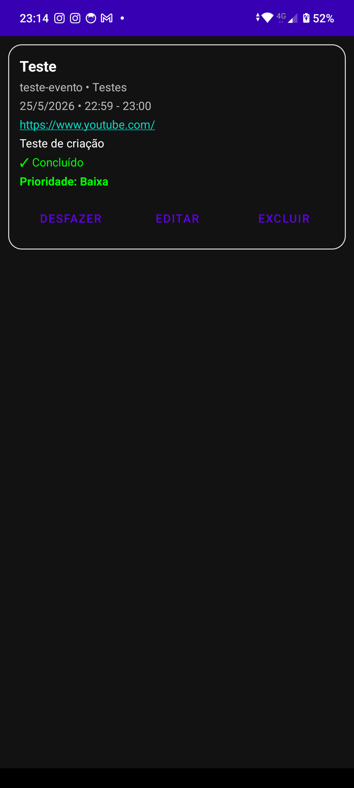
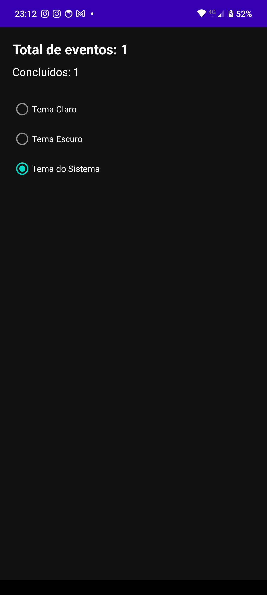
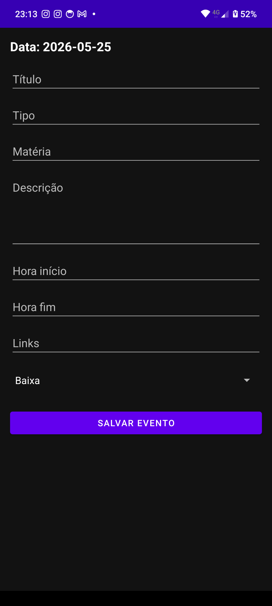
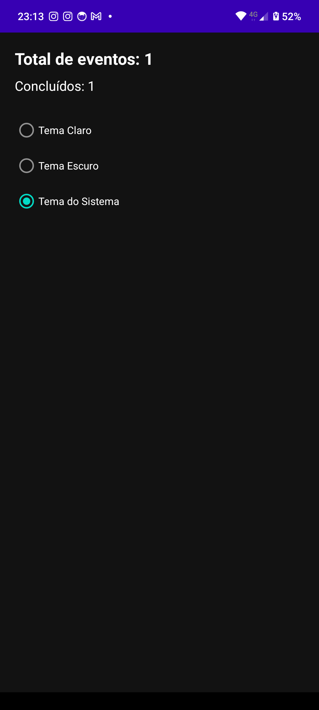

# 📚 Gestor de Eventos Acadêmicos

Aplicativo Android desenvolvido em Kotlin para gerenciamento de eventos, tarefas, provas, trabalhos e compromissos acadêmicos.

O sistema foi criado com foco em organização estudantil, produtividade e praticidade, utilizando calendário interativo, notificações e gerenciamento completo de eventos.

---

# 👨‍💻 Desenvolvedor

Wallex André Adriano dos Santos

---

# 🎯 Objetivo do Projeto

O objetivo do aplicativo é auxiliar estudantes na organização da rotina acadêmica através de um sistema simples, moderno e funcional.

O aplicativo permite:

- cadastrar eventos
- organizar compromissos
- visualizar tarefas no calendário
- acompanhar eventos pendentes
- controlar atividades concluídas

---

# 🛠 Tecnologias Utilizadas

- Kotlin
- Android Studio
- SQLite
- RecyclerView
- Material Design
- CalendarView (Kizitonwose)

---

# 📱 Funcionalidades

## ✅ Cadastro de Eventos

O sistema permite cadastrar:

- título
- tipo
- matéria
- descrição
- data
- horário inicial
- horário final
- links
- prioridade

---

## 📅 Calendário Interativo

- navegação entre meses
- seleção de dias
- indicador visual de eventos
- destaque do dia atual
- destaque do dia selecionado

---

## 📌 Gerenciamento de Eventos

- visualizar eventos
- editar eventos
- excluir eventos
- concluir eventos
- desfazer conclusão

---

## 🔔 Sistema de Notificações

- evento criado
- evento concluído
- evento excluído

---

# 📷 Prints do Aplicativo

## 🟣 Splash Screen



---

## 🏠 Tela Principal



---

## ➕ Cadastro de Evento



---

## 📅 Todos os Eventos


---

## 📅 Calendário com Evento


---

## 📊 Dashboard



---

# 📥 Download do APK

## 📱 APK do Aplicativo

[⬇️ Baixar APK](app-debug.apk)

---

# 🚀 Como Instalar o APK

## Android

1. Baixe o arquivo:

```text
app-debug.apk
```

2. Envie para o celular

3. Abra o APK

4. Permita instalação de fontes desconhecidas

5. Clique em instalar

6. Abra o aplicativo normalmente

---

# 🚀 Como Executar no Android Studio

## 1️⃣ Clonar o projeto

```bash
git clone [URL_DO_REPOSITORIO](https://github.com/Wallex-Andre/Gestor-Eventos-Academicos.git)
```

---

## 2️⃣ Abrir no Android Studio

- Abrir Android Studio
- Selecionar:

```text
Open Project
```

- Escolher a pasta do projeto

---

## 3️⃣ Sincronizar Gradle

Aguardar a mensagem:

```text
Gradle Sync Finished
```

---

## 4️⃣ Executar

- Conectar dispositivo Android
OU
- Abrir emulador

Depois clicar em:

```text
Run ▶
```

---

# 🗄 Banco de Dados

O aplicativo utiliza SQLite local para armazenamento dos eventos.

## 📄 Tabela Principal

```sql
Evento
```

## 📌 Campos

| Campo | Tipo |
|---|---|
| id | INTEGER |
| titulo | TEXT |
| tipo | TEXT |
| materia | TEXT |
| descricao | TEXT |
| data | TEXT |
| horaInicio | TEXT |
| horaFim | TEXT |
| links | TEXT |
| status | TEXT |
| prioridade | TEXT |
| concluido | INTEGER |

---

# 📌 Requisitos

- Android 5.0+
- Android Studio
- Kotlin
- Gradle

---

# 📖 Conclusão

O projeto Gestor de Eventos Acadêmicos foi desenvolvido com o objetivo de auxiliar estudantes na organização de tarefas e compromissos acadêmicos.

Durante o desenvolvimento foram aplicados conceitos de desenvolvimento Android com Kotlin, utilização de banco de dados SQLite, RecyclerView, notificações, manipulação de datas e personalização de interface.

O aplicativo apresenta funcionalidades completas de gerenciamento de eventos, oferecendo uma experiência prática e funcional para organização acadêmica.
