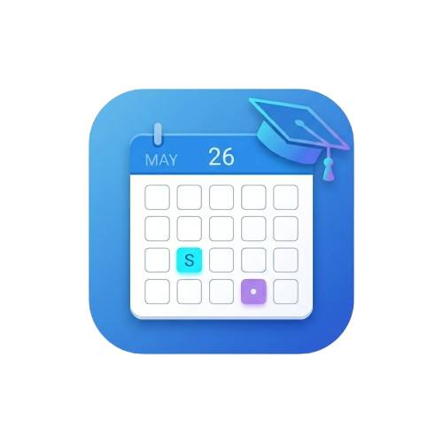
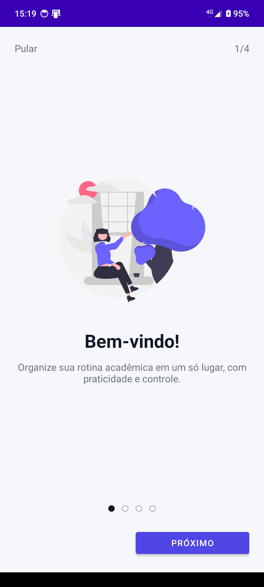
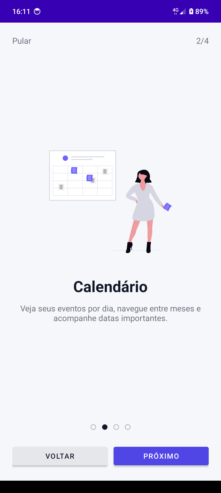
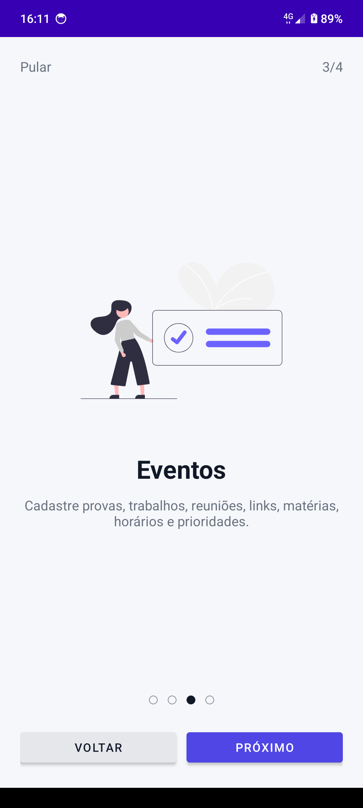
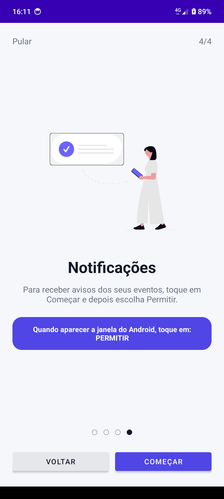
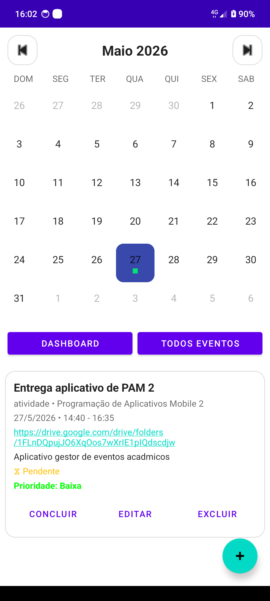
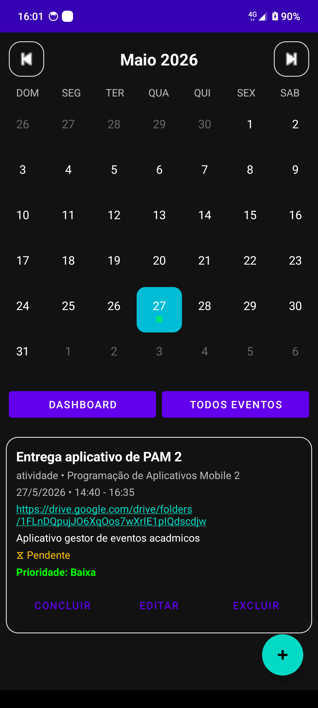
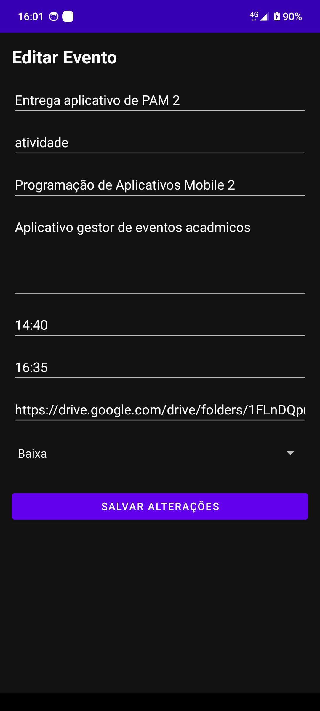
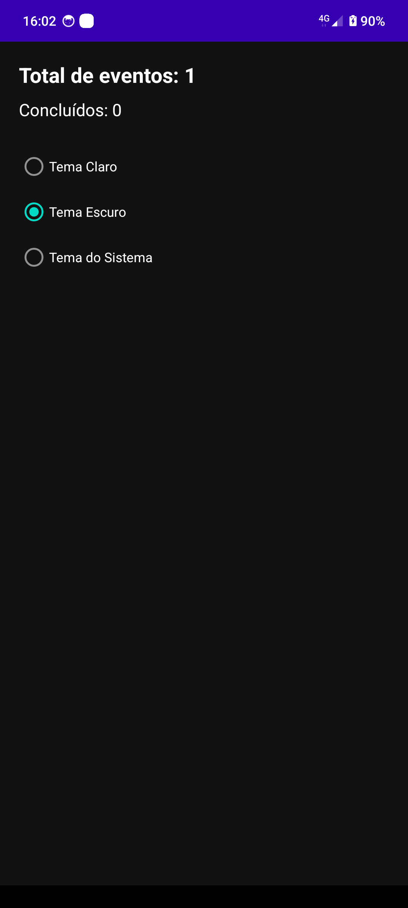

# 📚 Gestor de Eventos Acadêmicos

<p align="center">
  
</p>

<p align="center">
Aplicativo Android desenvolvido em Kotlin para gerenciamento de eventos, tarefas, provas e compromissos acadêmicos.
</p>

---

# 🚧 Status do Projeto

✅ Projeto finalizado
✅ Aplicativo funcional
✅ Compatível com tema claro e escuro
✅ Onboarding implementado
✅ Banco de dados SQLite integrado

---

# 👨‍💻 Desenvolvedor

**Wallex André Adriano dos Santos**

---

# 🎯 Objetivo do Projeto

O objetivo do aplicativo é auxiliar estudantes na organização da rotina acadêmica através de um sistema simples, moderno e funcional.

O sistema permite cadastrar, visualizar e gerenciar compromissos acadêmicos utilizando calendário interativo, notificações e controle de conclusão de eventos.

---

# 🛠 Tecnologias Utilizadas

* Kotlin
* Android Studio
* SQLite
* RecyclerView
* Material Design
* CalendarView Kizitonwose
* SharedPreferences
* NotificationManager

---

# 📱 Funcionalidades

## ✅ Cadastro de Eventos

O aplicativo permite cadastrar:

* título
* tipo/tag
* matéria
* descrição
* data
* horário inicial
* horário final
* links
* prioridade

---

## 📅 Calendário Interativo

* navegação entre meses
* troca de ano
* seleção de dias
* exibição de dias do mês anterior/próximo
* indicador visual de eventos
* destaque do dia atual
* destaque do dia selecionado

---

## 📌 Gerenciamento de Eventos

* visualizar eventos
* editar eventos
* excluir eventos
* concluir eventos
* desfazer conclusão
* identificar eventos atrasados

---

## 🔔 Sistema de Notificações

* evento criado
* evento concluído
* evento excluído
* solicitação de permissão no onboarding

---

## 🎨 Personalização

* tema claro
* tema escuro
* tema automático
* onboarding moderno
* interface responsiva

---

# 📷 Prints do Aplicativo

## 🧭 Onboarding

<p align="center">
  
  
</p>

<p align="center">
  
  
</p>

---

## ☀️ Tema Claro

<p align="center">
  
</p>

---

## 🌙 Tema Escuro

<p align="center">
  
</p>

---

## ➕ Cadastro e Gerenciamento

<p align="center">
  
  
  
</p>

---

# 📥 Download do APK

## 📱 APK do Aplicativo

[⬇️ Baixar APK](gestor-eventos-academicos.apk)

---

# 🚀 Como Instalar o APK no Android

1. Baixe o arquivo:

```text
gestor-eventos-academicos.apk
```

2. Envie o APK para o celular.

3. Abra o arquivo no dispositivo Android.

4. Permita instalação de fontes desconhecidas caso necessário.

5. Clique em instalar.

6. Abra o aplicativo normalmente.

---

# 🚀 Como Executar o Projeto

## 1️⃣ Clonar o Repositório

Abra o terminal e execute:

```bash
git clone https://github.com/Wallex-Andre/Gestor-Eventos-Academicos.git
```

---

## 2️⃣ Abrir no Android Studio

1. Abra o Android Studio

2. Clique em:

```text
Open
```

3. Selecione a pasta:

```text
Gestor-Eventos-Academicos
```

---

## 3️⃣ Sincronizar o Gradle

Aguarde a sincronização automática do projeto.

Espere aparecer:

```text
Gradle Sync Finished
```

---

## 4️⃣ Executar o Aplicativo

Conecte um dispositivo Android ou abra um emulador.

Depois clique em:

```text
Run ▶
```

ou utilize:

```text
Shift + F10
```

---

## 5️⃣ Gerar APK

Para gerar o APK debug:

```text
Build
→ Build APK(s)
```

O APK será gerado em:

```text
app/build/outputs/apk/debug/
```

---

# 🗄 Banco de Dados

O aplicativo utiliza SQLite local para armazenamento dos eventos.

## 📄 Tabela Principal

```sql
Evento
```

## 📌 Campos

| Campo      | Tipo    |
| ---------- | ------- |
| id         | INTEGER |
| titulo     | TEXT    |
| tipo       | TEXT    |
| materia    | TEXT    |
| descricao  | TEXT    |
| data       | TEXT    |
| horaInicio | TEXT    |
| horaFim    | TEXT    |
| links      | TEXT    |
| status     | TEXT    |
| prioridade | TEXT    |
| concluido  | INTEGER |

---

# 📂 Estrutura do Projeto

```text
Gestor-Eventos-Academicos/
│
├── app/
│   └── src/main/
│       ├── java/com/example/gestoreventos/
│       ├── res/layout/
│       ├── res/drawable/
│       ├── res/values/
│       └── AndroidManifest.xml
│
├── prints/
├── gestor-eventos-academicos.apk
├── README.md
└── build.gradle
```

---

# 🔮 Melhorias Futuras

* sincronização em nuvem
* integração com Google Calendar
* lembretes automáticos
* eventos recorrentes
* filtros avançados
* widgets para tela inicial

---

# 📌 Requisitos

* Android 5.0+
* Android Studio
* Kotlin
* Gradle

---

# 📄 Licença

Este projeto foi desenvolvido para fins acadêmicos e educacionais.

---

# 📖 Conclusão

O projeto **Gestor de Eventos Acadêmicos** foi desenvolvido com foco em produtividade, organização e gerenciamento acadêmico.

Durante o desenvolvimento foram aplicados conceitos de:

* desenvolvimento Android com Kotlin
* SQLite
* RecyclerView
* notificações
* gerenciamento de estados
* manipulação de datas
* personalização de interface
* onboarding de usuário

O resultado é um aplicativo funcional, moderno e adequado para uso acadêmico e portfólio.
